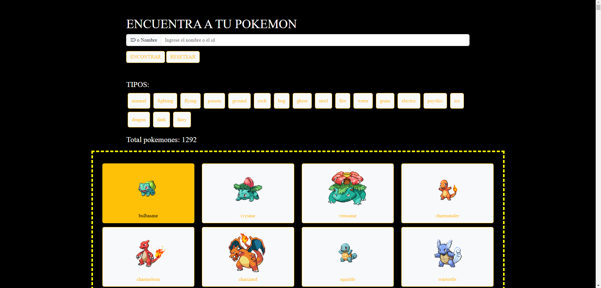
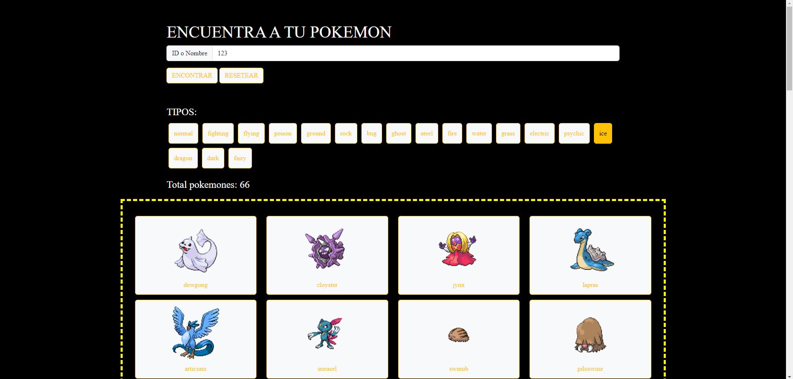
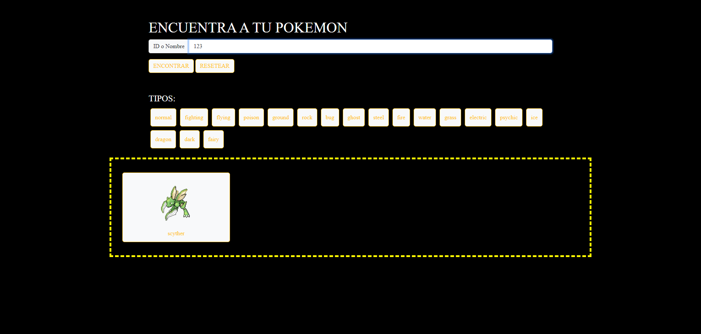
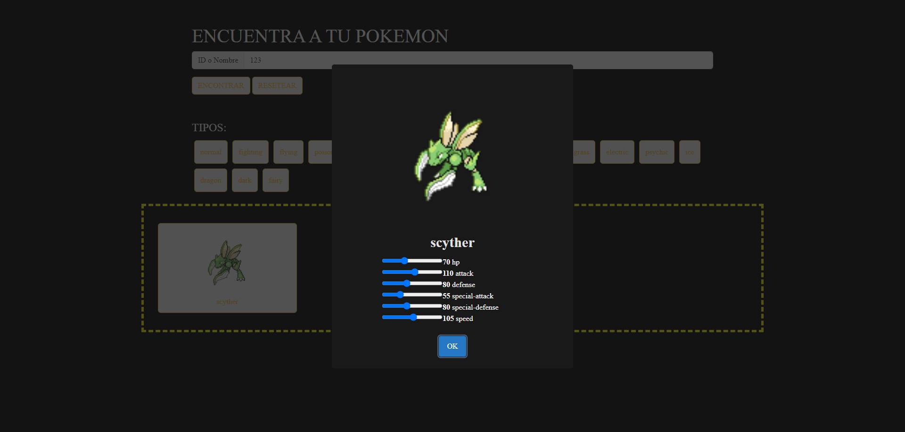

# Pokemones - Página de Búsqueda

Este es un proyecto web simple que te permite buscar y explorar información sobre Pokémon utilizando la [API de Pokémon](https://pokeapi.co/). Puedes buscar Pokémon por nombre o ID, explorar diferentes tipos de Pokémon y ver detalles de cada uno de ellos. Además puedes modificar sus estadísticas y guardarlas en tu propia base de datos con json-server.

## Características

- Búsqueda de Pokémon por nombre o ID.
- Exploración de diferentes tipos de Pokémon.
- Visualización de detalles de cada Pokémon, incluyendo estadísticas.

NOTA: Es importante esperar a que carguen todos los pokemones la primera vez que se abre la página, luego de que se carguen se pueden realizar las acciones.

## Capturas de Pantalla

- Página principal.

- Búsqueda de pokemones por tipo.

- Búsqueda de pokémon por ID o nombre.

- Visualización de estadísticas.

## Tecnologías Utilizadas

- HTML5
- CSS3
- JavaScript
- [Bootstrap](https://getbootstrap.com/)
- [SweetAlert2](https://sweetalert2.github.io/)
- [Node](https://nodejs.org/es)

## Base de datos

http://127.0.0.1:5010/pokemons

Nota: Para buscar un pokemon específico registrado en la base de datos, se debe agregar el id al final de la url, el id es asignado en orden ascendente según se vayan modificando las estadísticas de los pokemones y se registre su actualización.

Ejemplo: http://127.0.0.1:5010/pokemons/1

#

# Uso

NOTA: Para poder ejecutar el proyecto, debemos instalar algunas cosas primero en caso de no tenerlas:
1. Descargar la version 18.18.0 (https://nodejs.org/en)
2. Ejecutar el archivo descargado

Luego de tener instalado lo anterior:

1. Clona este repositorio en tu máquina local con el siguiente comando: `git clone https://github.com/JershonEspitia/ProjectPokemon.git`

2. Abre la terminal y ejecuta el comando `npm i`

3. Ejecuta en la terminal `npm run dev` para arrancar el servidor

4. Abre el archivo `index.html` en tu navegador web para ejecutar la aplicación

5. Ingresa el nombre o ID de un Pokémon en el campo de búsqueda y presiona "ENCONTRAR"
6. Explora diferentes tipos de Pokémon haciendo clic en los botones de tipo
7. Haz clic en un Pokémon para ver detalles como sus estadísticas

#

# Contribución
Si deseas contribuir a este proyecto, sigue estos pasos:

- Realiza un fork del proyecto.
- Crea una rama para tu contribución: git checkout -b feature/nueva-funcionalidad.
- Realiza tus cambios y haz commit: git commit -m 'Agrega una nueva funcionalidad'.
- Sube tus cambios a tu repositorio en GitHub: git push origin feature/nueva-funcionalidad.
- Crea un Pull Request en el repositorio original.

#

# Contacto
Si tienes alguna pregunta o comentario, no dudes en ponerte en contacto con el equipo de desarrollo.

# Autor

[By @JershonEspitia](https://github.com/JershonEspitia)

¡Diviértete explorando a los Pokémon!